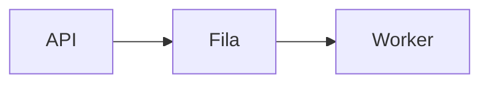

# Arquitetura

Texto de contexto antes do diagrama: cobrança em centavos via fila.
Os centavos passam por demo_src/payments antes do ledger.

```mermaid
flowchart LR
    A[API] --> B[Fila]
    B --> C[Worker]
```
